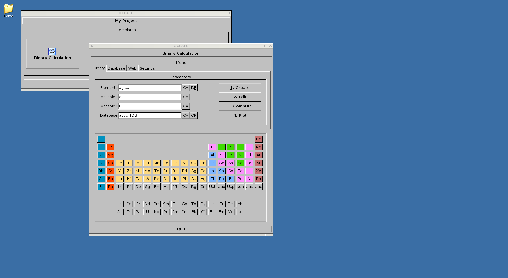
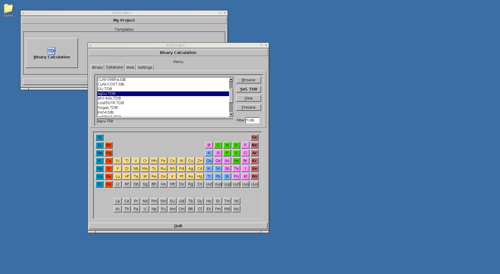
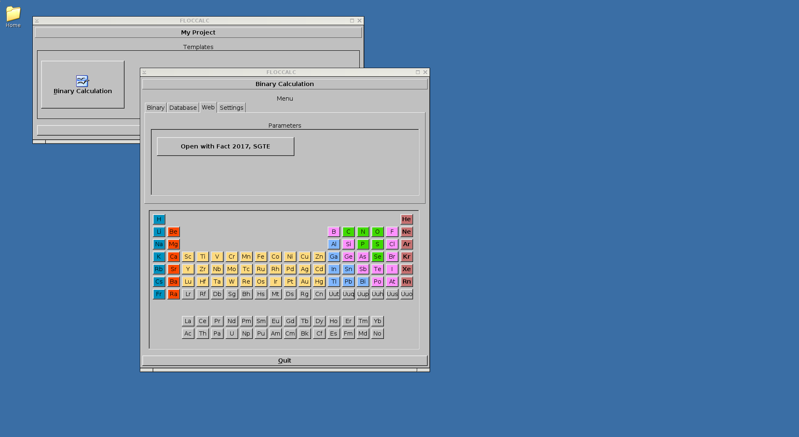
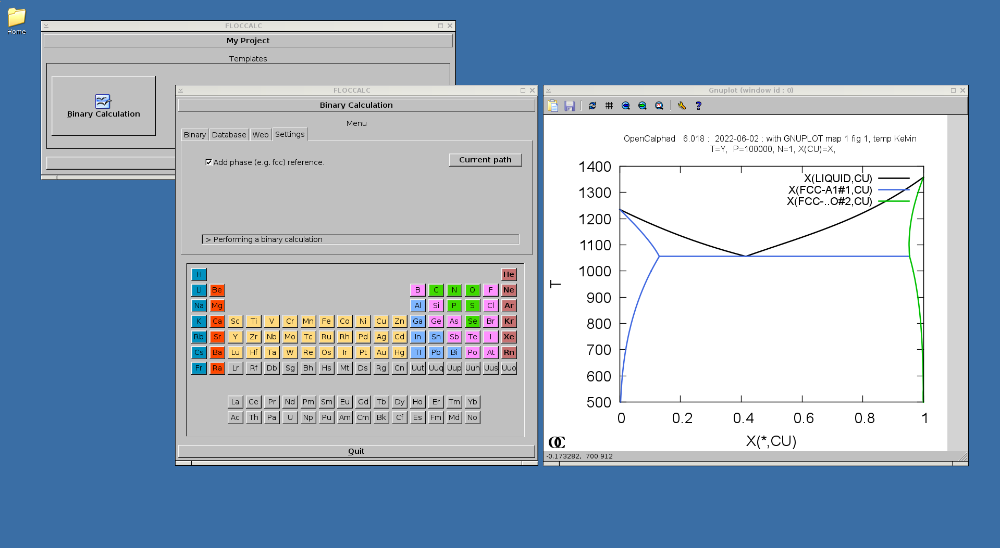
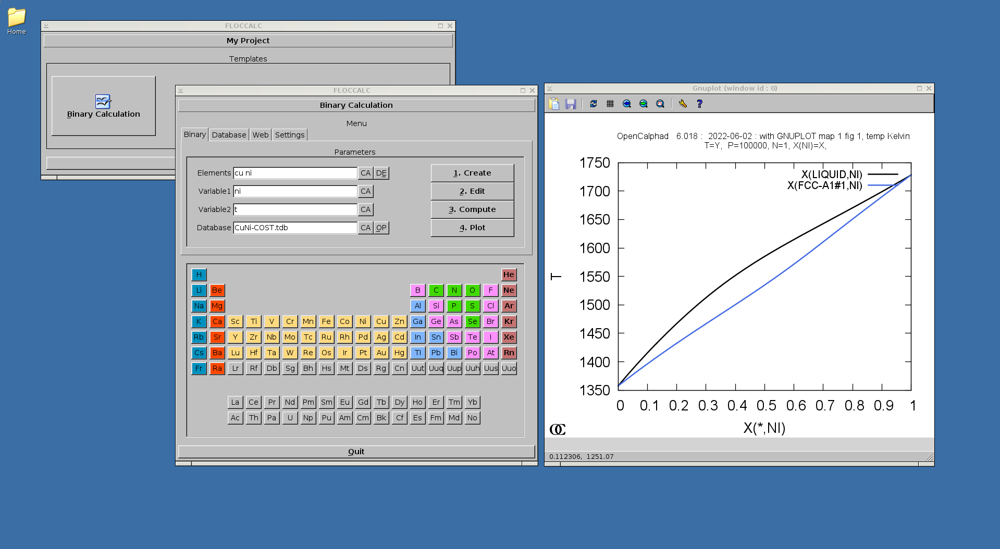
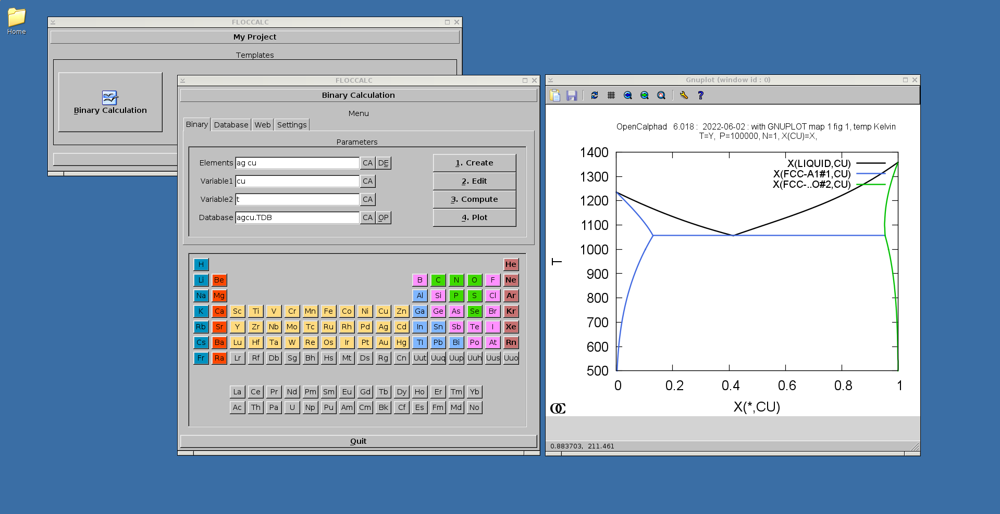

# floccalc
OpenCalphad Utility for binary calculation


## Screenshot










# Build


````
c++  -I"/usr/X11R7/include/" -I"/usr/pkg/include" -I /usr/pkg/include/    -L"/usr/pkg/lib"  -L/usr/X11R7/lib -lX11 -I /usr/X11R7/include/   -lfltk   src/floccalc.cxx    -o   floccalc    
c++  -I"/usr/X11R7/include/" -I"/usr/pkg/include" -I /usr/pkg/include/    -L"/usr/pkg/lib"  -L/usr/X11R7/lib -lX11 -I /usr/X11R7/include/   -lfltk   src/floccalc-binary.cxx    -o   floccalc-binary
````
Copy to /usr/local/bin/ 

Library: FLTK >=1.3

Gnuplot, OpenCalphad need to be available in /usr/local/bin (or /usr/bin) directory. 
